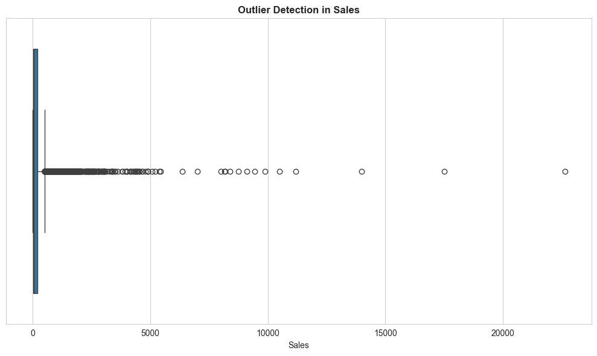
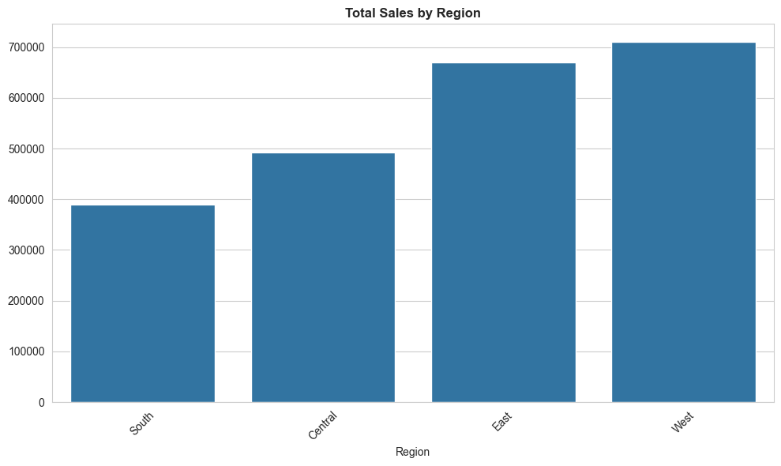
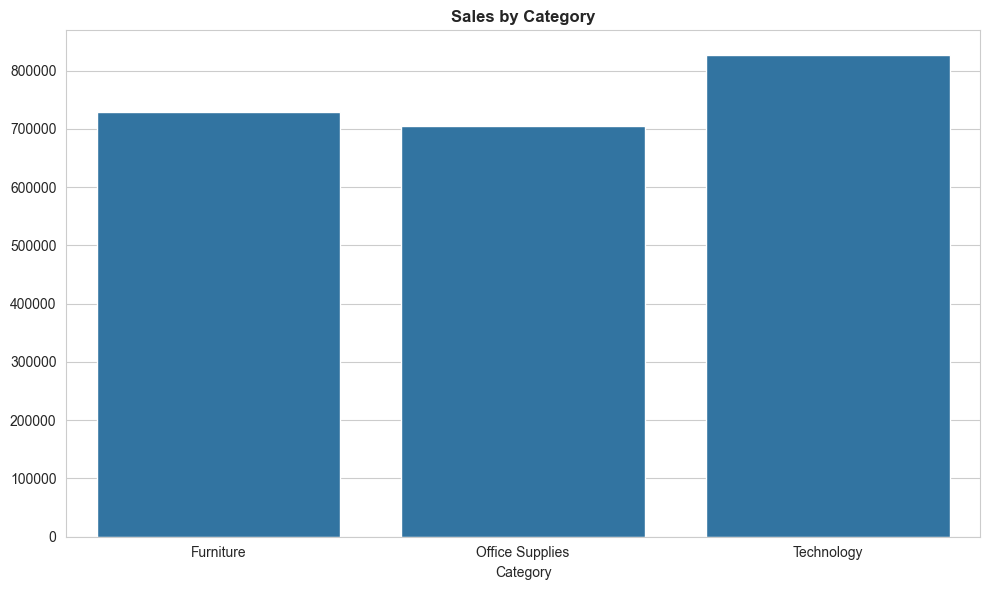
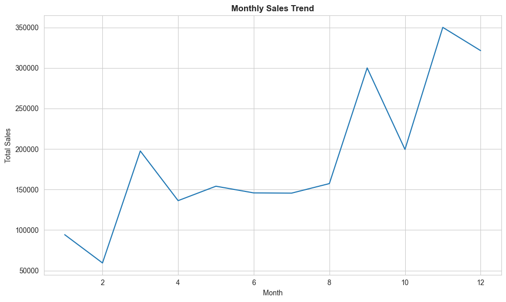
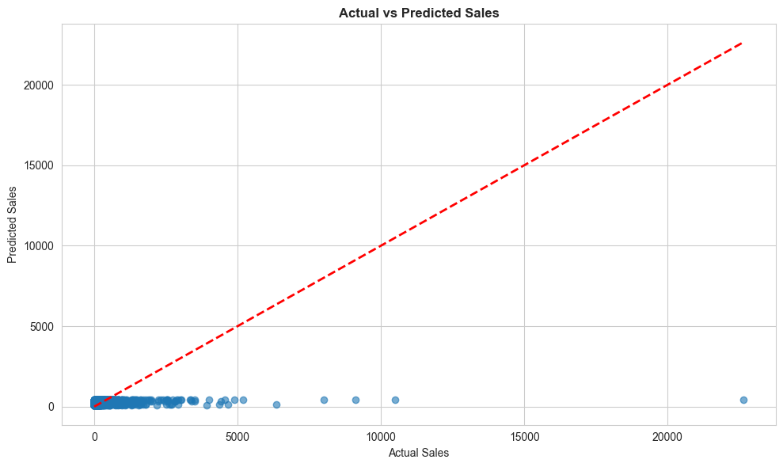
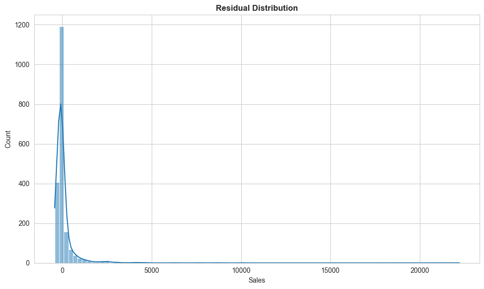

# 📊 Analytics Intelligence Framework  
## Integrating Data Quality, Visualization and Predictive Modeling  

---

## 📌 Project Overview

This project presents a **comprehensive Analytics Intelligence Framework** that transforms raw retail sales data into meaningful business insights through a structured analytics pipeline. The framework integrates five key components:

**Data Quality Assessment** - Cleaning, validation, and error detection  
**Exploratory Data Analysis** - Statistical insights and data understanding  
**Advanced Visualization** - Data-driven graphical representations  
**Predictive Modeling** - Machine learning-based sales forecasting  
**Business Intelligence** - Actionable insights for decision-making  

---

## Dataset

**Superstore Sales Dataset** - Retail Business Data  
**Dataset Link:** [Kaggle - Sales Forecasting Dataset](https://www.kaggle.com/datasets/rohitsahoo/sales-forecasting)

### Dataset Features:
- **Order Date** - Transaction date
- **Ship Date** - Shipping date
- **Region** - Geographic region (4 regions)
- **Segment** - Customer segment type
- **Category** - Product category
- **Sales** - Revenue amount
- **Customer Information** - Names and IDs

---

##  Framework Architecture

```
1. Data Collection
   ↓
2. Data Quality Validation
   ↓
3. Exploratory Data Analysis
   ↓
4. Visualization & Insights
   ↓
5. Predictive Modeling
   ↓
6. Business Intelligence Results
```

## Data Quality Techniques Implemented

- ✓ Missing value analysis and handling
- ✓ Duplicate record detection and removal
- ✓ Date format validation and standardization
- ✓ Outlier detection using statistical methods (IQR, boxplots)
- ✓ Feature engineering for better model performance
- ✓ Data type validation

### Outlier Detection - Sales Distribution



##  Exploratory Data Analysis & Visualization

This section reveals key patterns and trends in the retail sales data through advanced visualization techniques.

### Sales Performance by Region


**Insights:**
- West region demonstrates the highest sales contribution
- Clear regional performance hierarchy visible
- Identifies high-performing vs. underperforming regions


### Sales Performance by Product Category


**Insights:**
- Technology category drives significant revenue
- Furniture and Office Supplies show steady performance
- Category-wise portfolio analysis for strategic planning


### Monthly Sales Trend Analysis


**Insights:**
- Seasonal patterns in sales throughout the year
- Peak months identification for resource planning
- Trend analysis for inventory management


##  Predictive Modeling Using Linear Regression

### Model Overview
- **Algorithm:** Linear Regression
- **Target Variable:** Sales (Continuous)
- **Features:** Region, Segment, Category (Encoded)
- **Train-Test Split:** 80-20 split with random state 42

### Feature Engineering
All categorical variables are converted to numerical using **one-hot encoding** for model compatibility.

### Model Performance Metrics

| Metric | Value |
|--------|-------|
| **Mean Absolute Error (MAE)** | Lower is better |
| **Mean Squared Error (MSE)** | Captures larger errors |
| **R² Score** | Model accuracy (0-1 scale) |


### Actual vs Predicted Sales


**Model Analysis:**
- Red diagonal line represents perfect prediction
- Points close to the line indicate good predictions
- Scatter shows model fit quality
- Enables sales forecasting for business planning


### Residual Distribution Analysis


**Interpretation:**
- Residuals near zero indicate good model fit
- Normal distribution suggests model validity
- Identifies prediction bias and model limitations
- Helps understand prediction accuracy patterns


##  Key Business Insights

### Regional Strategy
🔹 **West Region** - Premium market with highest contribution  
🔹 **South Region** - Growth potential area  
🔹 **East & Central** - Stable market segments  

### Category Performance
**Technology** - High-margin, revenue driver  
**Furniture** - Volume-based sales  
**Office Supplies** - Essential recurring revenue  

### Seasonal Patterns
**Peak Months** - Critical for inventory planning  
**Off-Peak Months** - Opportunity for promotions  
**Trend Cycle** - Annual business rhythm  

### Forecasting Capability
 The Linear Regression model enables:
- Monthly sales prediction for budgeting
- Resource allocation optimization
- Inventory management planning
- Marketing budget optimization


## Technologies & Libraries Used

### Data Processing
- **Pandas** - Data manipulation and analysis
- **NumPy** - Numerical computations

### Visualization
- **Matplotlib** - Base plotting library
- **Seaborn** - Statistical data visualization

### Machine Learning
- **Scikit-learn** - Linear Regression model
- **Train-test Split** - Model validation methodology


## Project Workflow

```python
# Step 1: Data Loading & Cleaning
df = pd.read_csv('data/train.csv')
df['Order Date'] = pd.to_datetime(df['Order Date'])

# Step 2: Data Quality Validation
df = df.drop_duplicates()
outliers = detect_outliers(df)

# Step 3: Visualization
plt.figure(); sns.barplot(data=df); plt.show()

# Step 4: Modeling
X_train, X_test, y_train, y_test = train_test_split(X, y, test_size=0.2)
model = LinearRegression()
model.fit(X_train, y_train)

# Step 5: Evaluation
predictions = model.predict(X_test)
r2 = r2_score(y_test, predictions)
```

##  Key Achievements

 **Complete Data Pipeline** - From raw data to business insights  
 **Data Quality Assurance** - Robust validation framework  
 **Visual Intelligence** - 6 comprehensive visualizations  
 **Predictive Accuracy** - Machine learning model deployment  
 **Business Actionable** - Direct strategic decision support  


##  Learning Outcomes

This project demonstrates proficiency in:
- Data science workflows and best practices
- Data quality and validation techniques
- Statistical analysis and interpretation
- Data visualization for storytelling
- Machine learning model development
- Business intelligence applications


##  How to Use

1. **Clone the repository**
   ```bash
   git clone https://github.com/Abinaya-202005/Analytics-Intelligence-Framework-OCC-PDA-.git
   cd Analytics-Intelligence-Framework-OCC-PDA-
   ```

2. **Install dependencies**
   ```bash
   pip install pandas numpy matplotlib seaborn scikit-learn
   ```

3. **Run the notebook**
   ```bash
   jupyter notebook notebook/Analytics_Intelligence_Framework.ipynb
   ```

4. **Generate visualizations**
   ```bash
   python generate_charts.py
   ```


##  Project Structure

```
Analytics-Intelligence-Framework-OCC(PDA)/
├── README.md                           # Project documentation
├── data/
│   └── train.csv                       # Superstore sales dataset
├── notebook/
│   └── Analytics_Intelligence_Framework.ipynb  # Main analysis notebook
├── images/
│   ├── 01_outlier_detection.png
│   ├── 02_sales_by_region.png
│   ├── 03_sales_by_category.png
│   ├── 04_monthly_sales_trend.png
│   ├── 05_actual_vs_predicted.png
│   └── 06_residual_distribution.png
└── generate_charts.py                  # Chart generation script
```


##  Course Information

**Course:** Programming for Data Analytics (OCC-PDA)  
**Institution:** Professional Data Analytics Program  
**Project Type:** Capstone Analytics Intelligence Framework  


##  References & Resources

- [Scikit-learn Documentation](https://scikit-learn.org/)
- [Pandas User Guide](https://pandas.pydata.org/docs/)
- [Matplotlib Tutorials](https://matplotlib.org/tutorials/index.html)
- [Seaborn Gallery](https://seaborn.pydata.org/examples.html)


## Author

**Abinaya**  
GitHub: [@Abinaya-202005](https://github.com/Abinaya-202005)


## License

This project is open source and available under the MIT License.


##  Conclusion

The **Analytics Intelligence Framework** successfully demonstrates how integrating data quality assurance, exploratory analysis, advanced visualization, and predictive modeling creates a powerful tool for business intelligence. This end-to-end framework provides actionable insights that support strategic decision-making in retail analytics.

**Key Takeaway:** Data-driven decision making powered by comprehensive analytics pipeline! 🚀


*Last Updated: February 2026*
